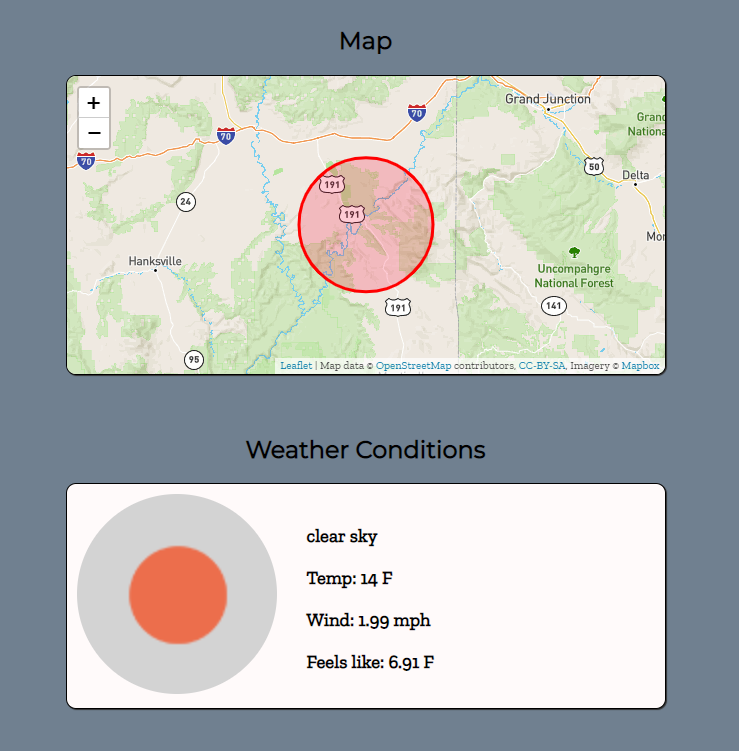

# Trail Finder - Mountain Biking

[Trail Finder - Mountain Biking](https://thebryceiverse.github.io/mtbTrailFinder/)

---

## Summary Section

Welcome to my mountain biking trail finder App! In the 3 fields available from the home screen, start by: 

1. Typing in the nearest city you will be riding, for example enter "Moab" for Moab, UT. 
2. Choosing the max distance or max radius from that city you would like to search (in miles). For example enter "20" for a 20 miles radius. 
3. Selecting how many trails you want to return in this search. For example enter "30" to return 30 results (if that many are available)

After all 3 fields are filled in you can select the "GO!" button or press "ENTER" to return the results. 

You'll notice that a "Weather Conditions" tile will appear with current weather conditions in the area you will be riding. Just below the weather tile will be the "Trail Results" tiles displaying just that, the different trails available within your search parameters. 

Within the Trail Results tiles, if you click on either the title or image(if available), you will be redirected to a new tab. This new tab will have take you too the "MTB Project" website and will have advanced information of that specific trail.  

See below screen shots of an example search: 

---

## Technology used

- HTML
- CSS
- JavaScript
- jQuery

## API's Used

- MTB Project Data API [MTB Project API](https://www.mtbproject.com/data)
- Open Weather Map API [Open Weather Map API](https://openweathermap.org/api)

## Interactive Map Used

- LeafletJS [LeafletJS Map](https://leafletjs.com/)